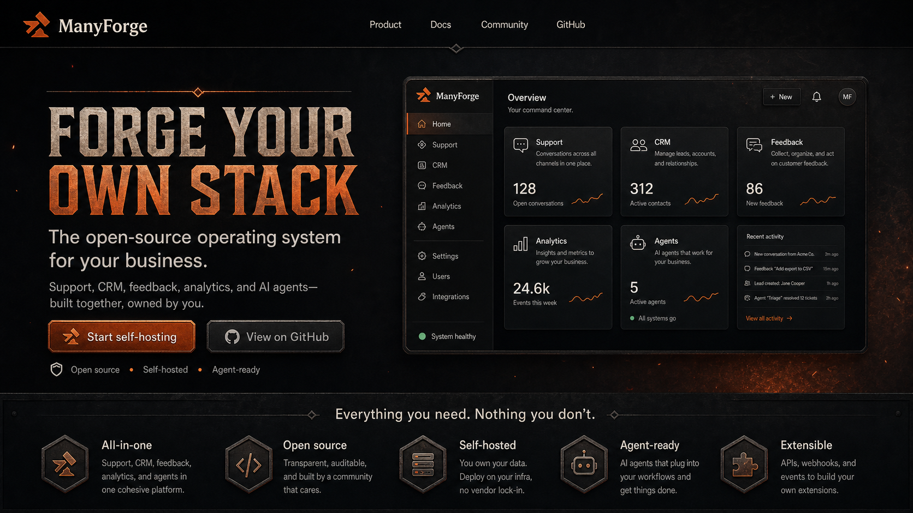
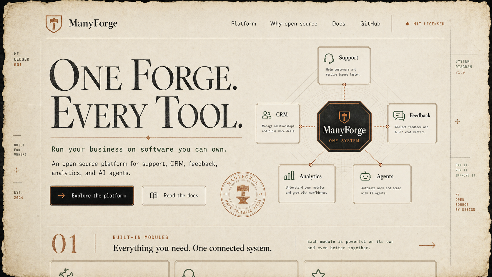
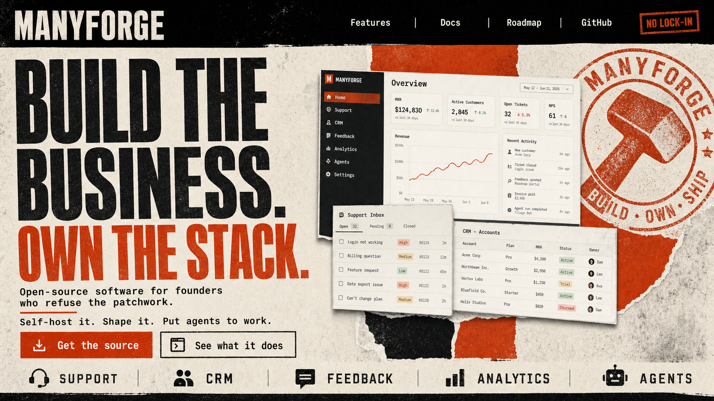

# manyforge.com visual directions

Three high-fidelity concept comps for the public ManyForge website. They share
the same positioning—an open-source, self-hostable operating system for founders
and SMBs—but explore different amounts of blacksmith, fantasy, and grunge.

These are visual-direction studies, not production page designs. Product UI,
icons, copy details, responsive behavior, and accessibility still need to be
resolved in HTML/CSS.

## 1. The Ember Console

The most direct expression of the brief: coal-black surfaces, forged-steel
panels, restrained sparks, and an ember-orange accent. The real-looking product
dashboard keeps the theme grounded in credible business software.

**Best for:** the primary site direction.

**Keep:** the hammer/anvil maker's mark, strong product preview, dark material
palette, and orange used as heat rather than decoration.

**Watch:** the display face and beveled controls can drift into game UI. The
production version should flatten the controls and reduce surface texture around
body copy.

## 2. The Guild Ledger

An editorial interpretation of the forge: parchment, soot ink, copper rules,
maker's stamps, and a connected-system diagram. It feels crafted and distinct
without relying on literal fire or a fantasy scene.

**Best for:** documentation, architecture, manifesto, and open-source story
pages—or as the typography/grid system mixed into direction 1.

**Keep:** the large serif/small mono pairing, margin annotations, architecture
diagram, copper accents, and maker's-seal language.

**Watch:** use clean warm paper in production. Deckled edges and stains should
be reserved for a hero or campaign asset so the site does not become a prop.

## 3. Strike / Build / Own

A louder, anti-lock-in direction built from industrial posters, screen printing,
halftone, torn paper, and an oversized hammer stamp. It has the clearest founder
attitude and strongest campaign energy.

**Best for:** launch pages, social graphics, contributor campaigns, release
announcements, and selected moments on the main site.

**Keep:** the compressed headline, blunt ownership message, modular product
montage, rigid navigation rail, and stamped "no lock-in" motif.

**Watch:** this much texture is tiring across a full documentation or product
site. Keep grunge at section boundaries and outside reading surfaces.

## Recommended synthesis

Use **The Ember Console** as the base, borrow the **Guild Ledger** typography and
connected-system diagrams, and reserve **Strike / Build / Own** for campaign
moments. That yields a site that feels unmistakably ManyForge while remaining
credible to developers and practical for long-form product content.

Suggested foundation:

- Coal `#090909`, iron `#171513`, warm paper `#E9E0CF`
- Ember `#E15B2A` as the main accent; brass `#C8894D` for secondary detail
- A compact hammer/anvil maker's mark rather than a literal fantasy illustration
- Expressive display serif or compressed grotesk for headlines; neutral sans
  serif for interface/body copy; mono for labels and technical annotations
- Clean content surfaces with texture confined to edges, dividers, stamps, and
  transitions

## Shared positioning used in the comps

- Open-source and self-hostable
- One connected system rather than a patchwork of SaaS tools
- Support, CRM, feedback, analytics, and AI agents
- Ownership, extensibility, and no lock-in

The full generation prompts are recorded in [PROMPTS.md](PROMPTS.md).
